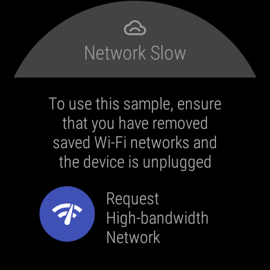
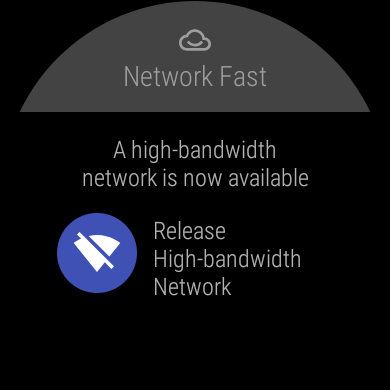
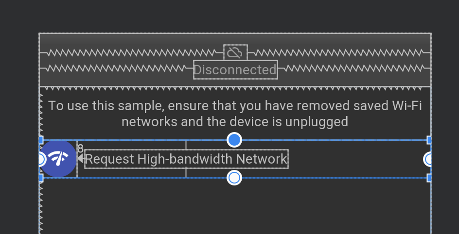

# wearos_connectivity
Smartwatch 등에서 Network를 사용하려고 하면, 끊기는 연결(특히 충전을 하지 않는 경우)을 코드로 보정하기 위한 수단. <br/>
테스트 완료. <br/>
느낌 성공적..
## Screenshots
 

## Layout


## References
* WearHighBandwidthNetworking
```
https://github.com/android/wear-os-samples/tree/master/WearHighBandwidthNetworking
```
